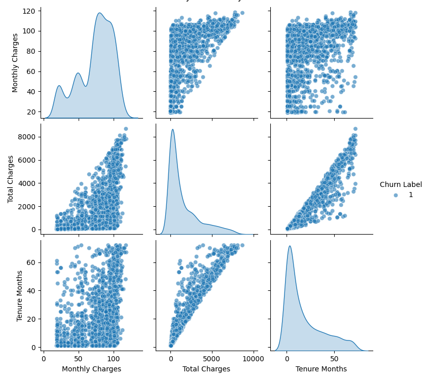

# Customer Churn Prediction with K-Nearest Neighbors (KNN)

## Overview

This project focuses on building a machine learning model to predict customer churn for a telecommunications company. By analyzing customer usage patterns and account details, the model identifies customers who are likely to cancel their service. This proactive identification allows the company to implement targeted retention strategies. The project uses the K-Nearest Neighbors (KNN) algorithm, a simple yet powerful instance-based learning method.

## Features

- Data loading and preprocessing from a local CSV file.

- Handling of categorical and numerical data.

- Feature scaling, a critical step for distance-based algorithms like KNN.

- Hyperparameter tuning using GridSearchCV to find the optimal number of neighbors (k).

- Model evaluation using key metrics for imbalanced datasets, such as the F1-Score and ROC Curve.

- Data visualization to understand feature distributions and model performance.

## Technologies Used

- Python: The core programming language for the project.

- pandas: For data manipulation and analysis.

- scikit-learn: For machine learning model implementation, including preprocessing, model training, and evaluation

- matplotlib & seaborn: For data visualization.

## Data Analysis & Processing

The project begins by loading the Telco Customer Churn dataset from a local CSV file. Key preprocessing steps include:

- One-Hot Encoding: Converting categorical features (e.g., gender, Contract, PaymentMethod) into a numerical format.

- Feature Scaling: Using StandardScaler to standardize numerical features. This is essential for KNN, as it ensures all features contribute equally to the distance calculation.

- Data Splitting: The dataset is divided into training and testing sets to properly evaluate the model's performance on unseen data.

## Model Used

The primary model used in this project is the K-Nearest Neighbors (KNN) classifier. KNN works by classifying a new data point based on the majority class of its 'k' nearest neighbors in the feature space.Model TrainingThe KNN model is trained using a Grid Search with Cross-Validation. This process systematically tests different values for the number of neighbors (n_neighbors) and distance metric (p) to find the combination that yields the best performance on the training data.

## How to Run the Project

1. Clone the repository:

```bash
git clone <https://github.com/sjain2580/Customer-Churn-Prediction-K-NN>
cd <repository_name>
```

2. Create and activate a virtual environment (optional but recommended):python -m venv venv

- On Windows:
  
```bash
.\venv\Scripts\activate
```

- On macOS/Linux:

```bash
source venv/bin/activate
```

3. Install the required libraries:

```bash
pip install -r requirements.txt
```

4. Run the Script:

```bash
python prediction.py
```

## Visualization

The project includes visualizations to better understand the model's behavior:

- Pair Plots: Used to visualize relationships and distributions between different features.ROC Curve: A plot that illustrates the model's ability to distinguish between the churned and non-churned classes at various classification thresholds.


## Contributors

**<https://github.com/sjain2580>**
Feel free to fork this repository, submit issues, or pull requests to improve the project. Suggestions for model enhancement or additional visualizations are welcome!

## Connect with Me

Feel free to reach out if you have any questions or just want to connect!
**[](https://www.linkedin.com/in/sjain04/)**
**[](https://github.com/sjain2580)**
**[](mailto:sjain040395@gmail.com)**

---
